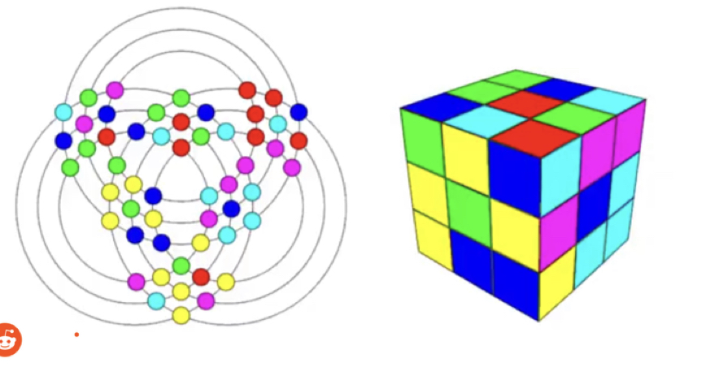
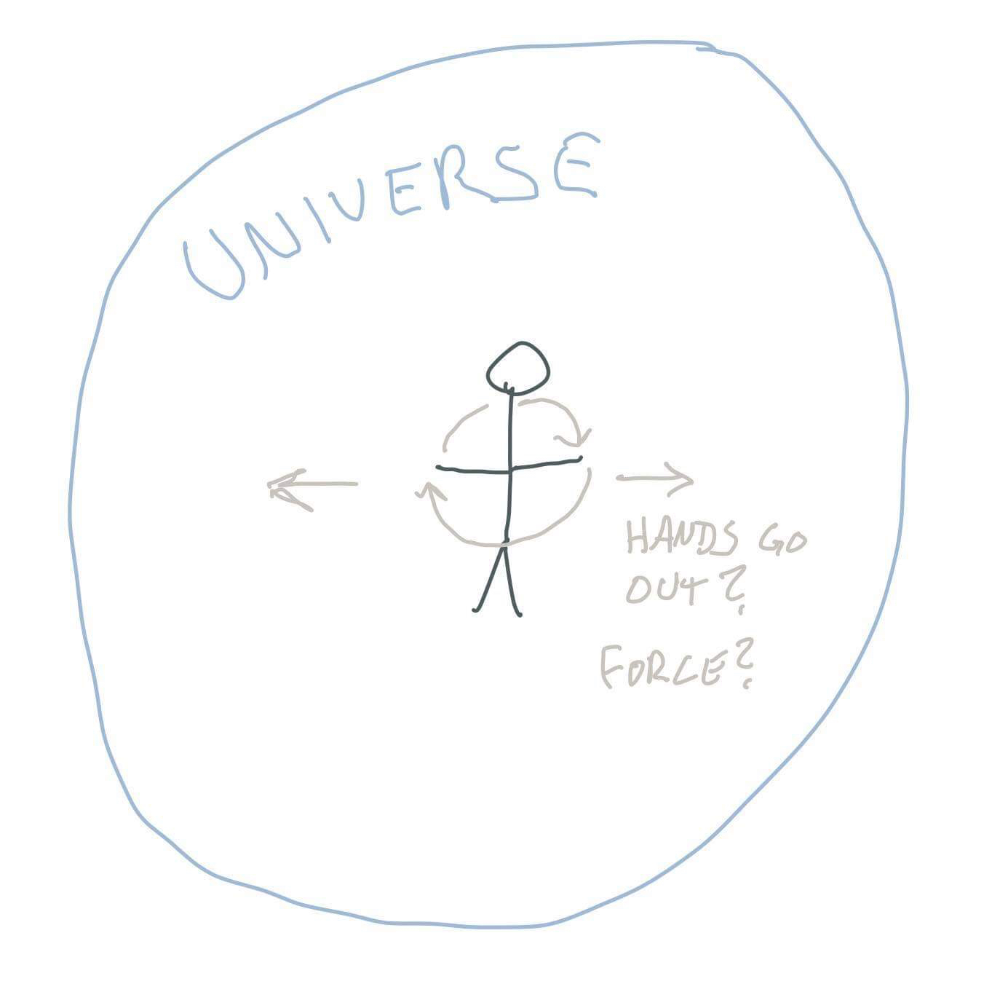
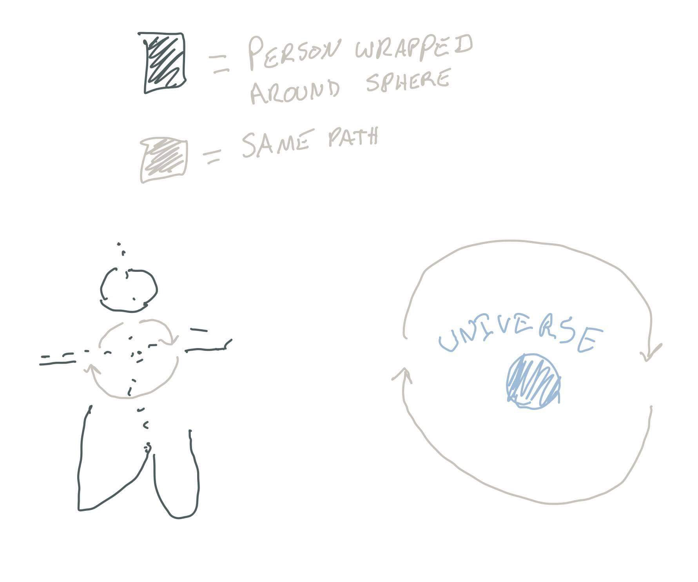
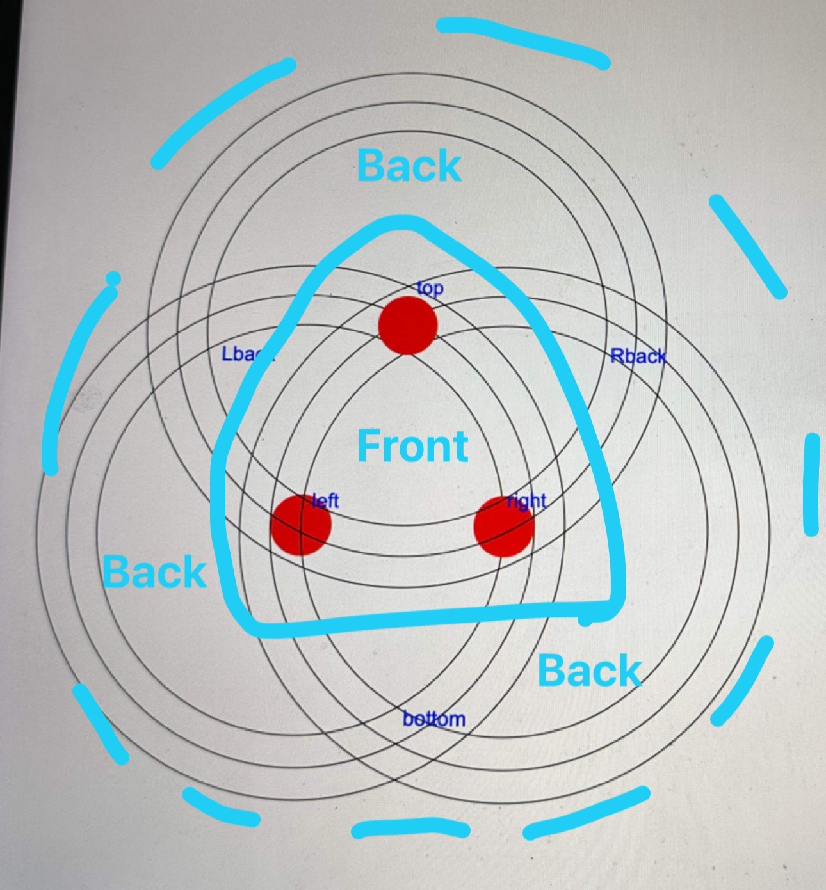
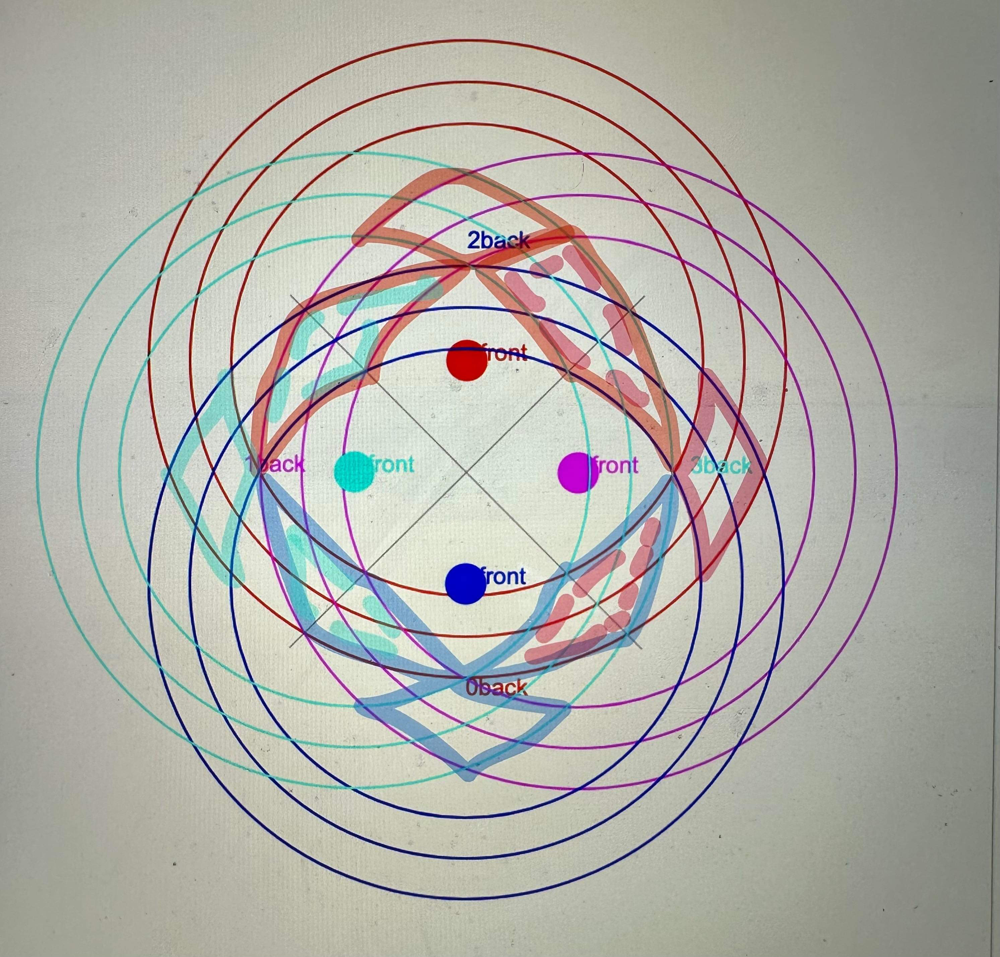
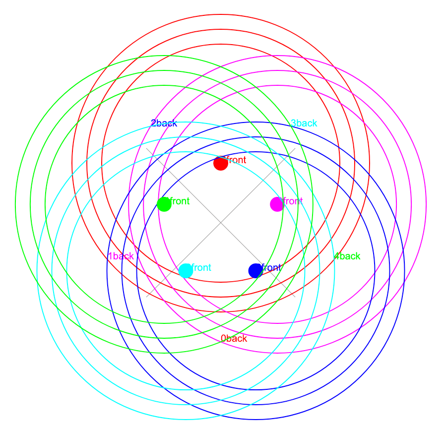
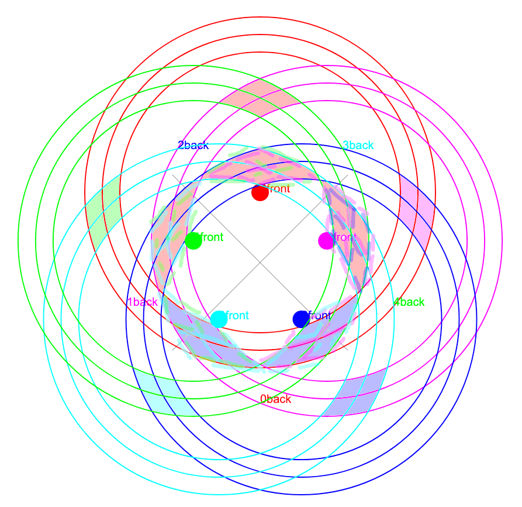

# Seedwalking

As time passes the average person gains a greater understanding of the space around them. First we were shadows on a wall, then we walked on the grass, now we fly around the stars.

The goal of this project is to make it easier for a random person to navigate higher dimensional spaces, like the [jungle gym](https://en.wikipedia.org/wiki/Jungle_gym#History) a century before.

## Rings

This particular approach was inspired heavily by a Rubik's Cube [post on reddit](https://www.reddit.com/r/BeAmazed/comments/z04zrm/now_the_legendary_rubiks_cube_is_easy_to/).

This projection is most easily understood if the user is first familiar with how to invert a reference frame around a sphere (or cone).

Applied to the Rubik's Cube

Extending the projection to 4d. If the highlighted faces are counted, excluding overlap, we have 8 faces. This makes sense because 2 faces per dimension.

In the original post, the 3 faces (27 points, 9 per face) closest to the origin (center of image) are the 3 faces that are closest to the vertex the projection is viewed from. When extended to 4d, there should be 4 faces that are equal distance to the origin vertex. The 4 faces that are furthest from the origin are the back faces.

We can now extend to 5d

At a glance it may not be clear which faces we are looking at, but with highlighting we can clearly see the 5 front faces and the 5 rear faces

With this projection in mind, the hope is the user can obtain a more intuitive understanding of how rotating each dimension (ring) will change the vertex the user views the tesseract from. Happy memory making...

### Notes

- When only two rings are present, why does the center not perfectly line up with one of the sub-rings? What are the best values for ring radius and offsets?
- Not sure if the back labels make sense in higher dimensions
